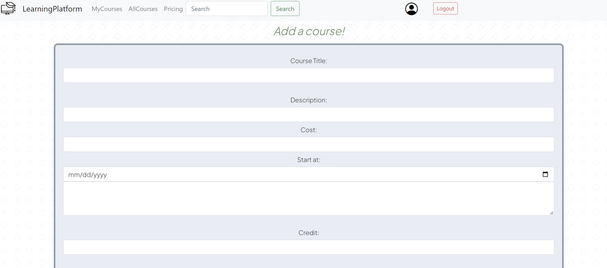
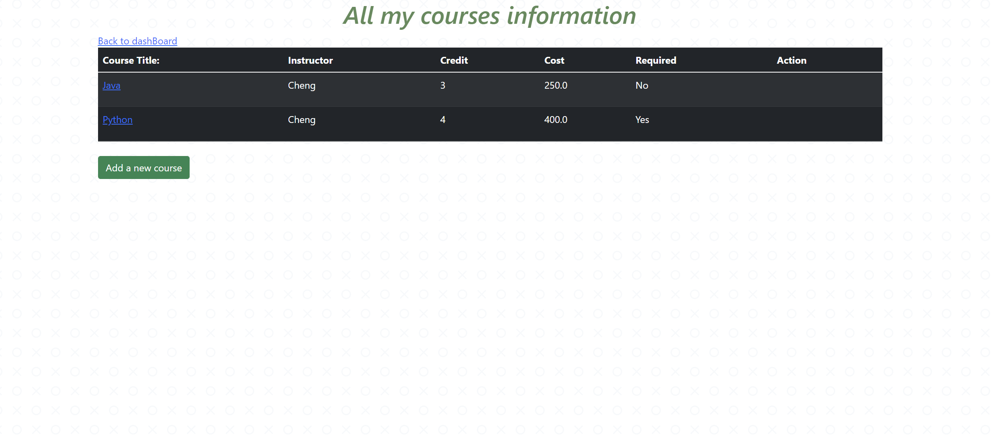
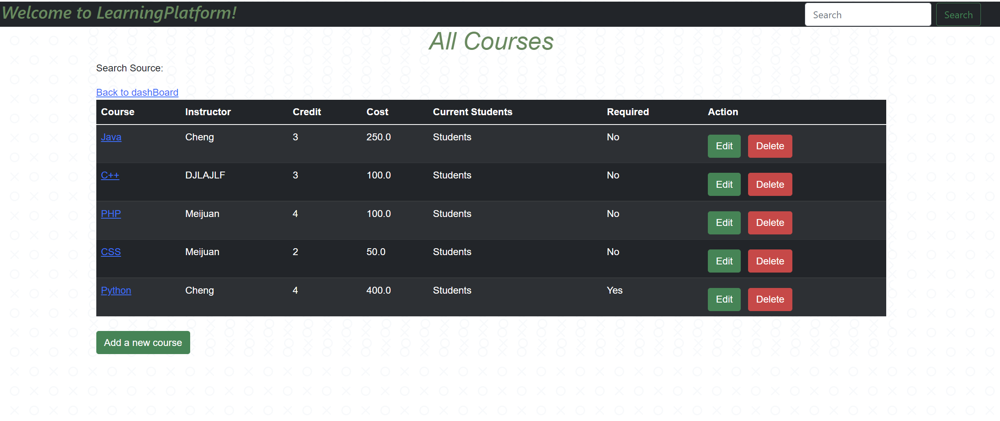

# TestLearningPlatform
A learning platform website for teachers and students manage courses using: Java, Spring Boot, Bootstrap, MySQL and AWS EC2

DashBoard 

For teachers to add a course

Show all my courses

Show all the courses available 

